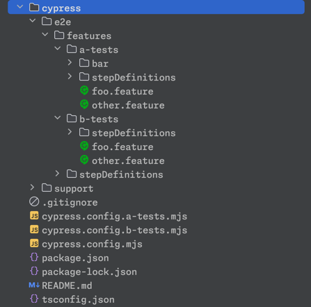
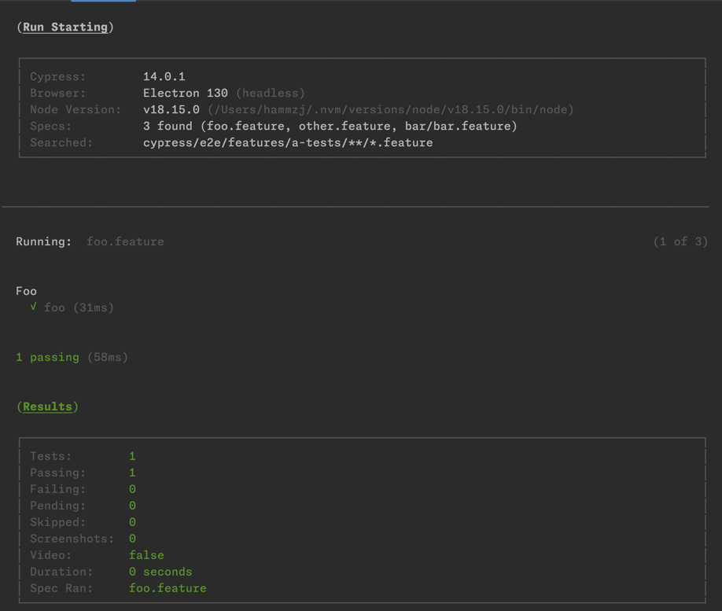
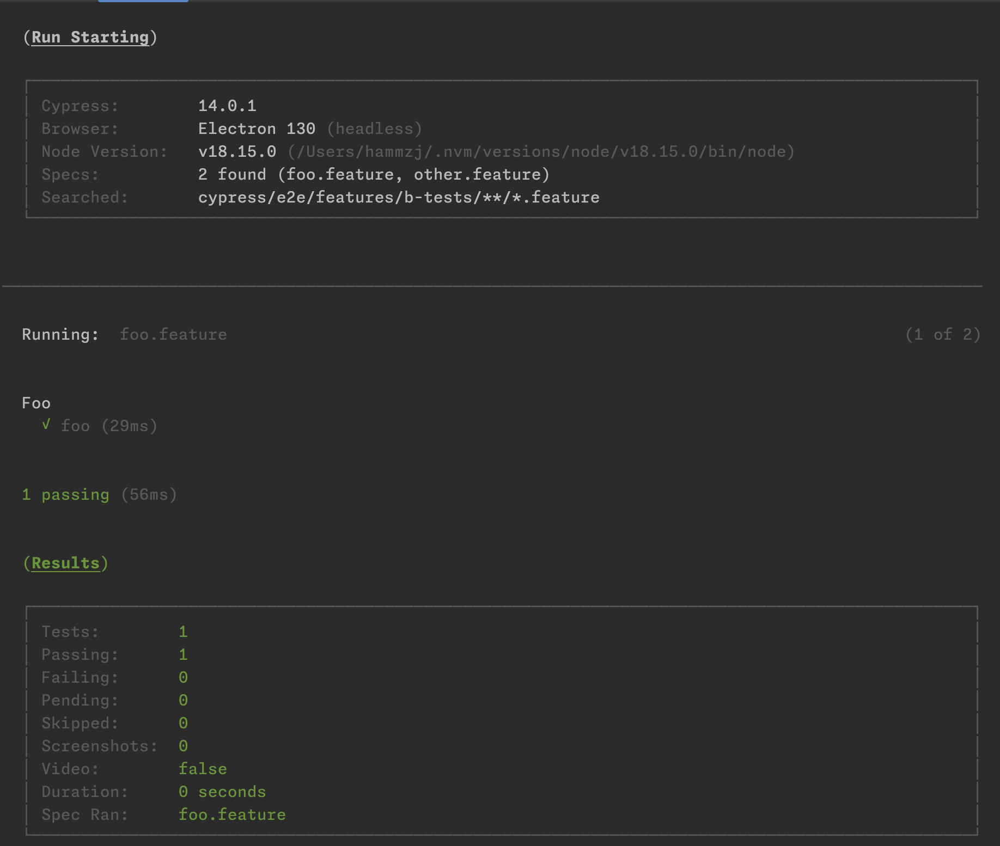

# Handling multiple Cypress configurations with distinct step definition directories

## Details

* **Original Issue:** [#1299](https://github.com/badeball/cypress-cucumber-preprocessor/issues/1299)
* **Author:** [Zachary Hamm (@hammzj)](https://github.com/hammzj)

Let's make an assumption that there is a project with more than one configuration for the application under test.
Let's also assume that these separate configurations can have duplicated step definitions with different function
handlers underneath.

How can this be managed without causing step definition collisions and failures due to configuration issues?

## Example

The easiest way to manage multiple application configurations is to use multiple Cypress configuration files, with one
for each configuration as needed, as well as separate `e2e` directories to manage distinct feature file sets. Then,
within each configuration, a Cypress environment variable can be set for
`stepDefinitions` to call out the separated step definition directories, along with any common step definition
directories as well.

Assume that there is a test directory as such:


Both "a-tests" and "b-tests" have a step definition in their own nested "stepDefinition" directories named:

```
//cypress/e2e/features/a-tests/stepDefinitions/a.js
Given('foo', function() {
  this.foo = 'A'
});
```

```
//cypress/e2e/features/b-tests/stepDefinitions/b.js
Given('foo', function() {
  this.foo = 'B'
});
```


If I were to run any of the tests, they would fail because the preprocessor would detect both step definitions!
In order to keep them separate, we need to declare the `stepDefinition` paths via the Cypress `env` within their
configuration files.

### Cypress configuration files

#### `cypress.config.js`

This is an example base file containing common options that configure the Cucumber preprocessor.

<details> 

```ts
import {defineConfig} from "cypress";
import createBundler from "@bahmutov/cypress-esbuild-preprocessor";
import {addCucumberPreprocessorPlugin} from "@badeball/cypress-cucumber-preprocessor";
import {createEsbuildPlugin} from "@badeball/cypress-cucumber-preprocessor/esbuild";


export default defineConfig({
  e2e: {
    baseUrl: "https://www.cypress.io",
    specPattern: "**/*.feature",
    setupNodeEvents: async function (on, config) {
      await addCucumberPreprocessorPlugin(on, config);
      on(
        "file:preprocessor",
        createBundler({
          plugins: [createEsbuildPlugin(config)],
        })
      );
      return config;
    },
    env: {}
  },
});
```

</details>

#### `cypress.config.a-tests.js`

Below is a file for a configuration named **"a-tests"**. It also extends the base config file, with changes to the
`specPattern`
and `stepDefinitions`.

<details>

```ts
import {defineConfig} from 'cypress';
import baseConfig from './cypress.config.js';

const mutatedConfig = baseConfig;

// Edits
mutatedConfig.e2e.specPattern = 'cypress/e2e/features/a-tests/**/*.feature';
//Declare step def directories using Cypress env
mutatedConfig.e2e.env.stepDefinitions = [
  //Common step definitions
  "cypress/e2e/features/stepDefinitions/**/*.{js,ts}",
  //Steps specific to "features/a-tests"
  "cypress/e2e/features/a-tests/[filepart]/stepDefinitions/**/*.{js,ts}"
]


// Export new config
export default defineConfig(mutatedConfig);
```

</details>

#### `cypress.config.b-tests.js`

Below is a file for a second distinct configuration named **"b-tests"**. It also extends the base config file, with
changes to the `specPattern`
and `stepDefinitions`.

<details>

```ts
import {defineConfig} from 'cypress';
import baseConfig from './cypress.config.js';

const mutatedConfig = baseConfig;

// Edits
aConfig.e2e.specPattern = 'cypress/e2e/features/b-tests/**/*.feature';
//mutatedConfig step def directories using Cypress env
mutatedConfig.e2e.env.stepDefinitions = [
//Common step definitions
  "cypress/e2e/features/stepDefinitions/**/*.{js,ts}",
//Steps specific to "features/b-tests"
  "cypress/e2e/features/b-tests/[filepart]/stepDefinitions/**/*.{js,ts}"
]


// Export new config
export default defineConfig(mutatedConfig);
```

</details>


Running both of these features now will pass:

> `cypress run -C cypress.config.a-tests.mjs`
> This also works for individual specs:
> `cypress run -C cypress.config.a-tests.mjs --spec "cypress/e2e/features/a-tests/foo.feature"`

```gherkin
# cypress/e2e/features/a-tests/foo.feature

Feature: Foo

  Scenario: foo
    Given foo
    And common
    Then foo is "A"
```



***


> `cypress run -C cypress.config.b-tests.mjs`
> This also works:
> `cypress run -C cypress.config.a-tests.mjs --spec "cypress/e2e/features/b-tests/foo.feature"`

```gherkin
# cypress/e2e/features/b-tests/foo.feature

Feature: Foo

  Scenario: foo
    Given foo
    And common
    Then foo is "B"
```



## Notes

The above solution works with both declaring a configuration file plus any spec patterns on the command line:

* `cypress run -C cypress.config.a-tests.js`
* `cypress run -C cypress.config.a-tests.js --spec "**/a-tests/a.feature`

Declaring step definition directories via the `Cypress.env` will override any base `stepDefinitions` option set for the
Cucumber preprocessor, whether it was declared via the `package.json`, Cosmic configs for
`.cypress-cucumber-preprocessorrc.json`, or within any base Cypress configuration files.

## Associated Docs and Links
* [Configuration overrides](../configuration.md#configuration-overrides)
* [step-definitions.md](../step-definitions.md)
* [Example project](https://github.com/hammzj/cypress-cucumber-preproccessor-steps-issue-step-definitions-and-updated-spec-pattern/tree/example)
